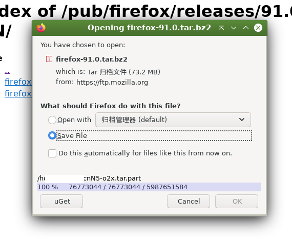

Firefox userChrome script

1. **Open external downloader** directly from Firefox's native download asking dialog. Adds a button to call system command and pass argument to it. (Modify it yourself to use your downloader)
2. Show automatically-started download progress

Tested on Firefox 128.

This script needs to be improved still, I think

1. pass cookie and reference url to external downloader also
2. make use of the auto-started download partial file

welcome open issue or PR if you have any idea.

----------------

This repo only contains the specific function, doesn't contain the code to enable userchrome scripts.

**For how to enable, see: (also more of my scripts)**

https://garywill.github.io/#Firefox-userChrome-CSS-or-JS
